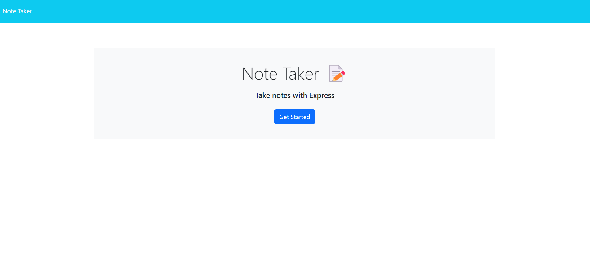
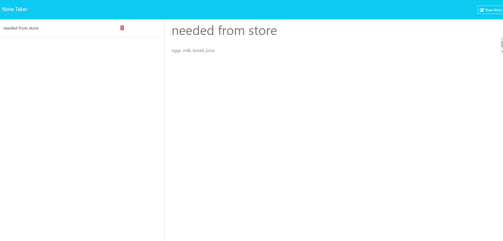

# Note Taker

## Description

This web app is a quick, easy way to jot down and easily keep track of notes, right in your browser! This was built using Express.js and deployed via Render. 
In creating this, I got the opportunity to practice some key components of backend development: using Node.js and Express.js, writing my own API routes, modularizing said routes to keep them organized, and deploying apps via Render. I wrote a couple of HTML routes and several API routes: GET, POST, and DELETE methods for displaying, adding, and deleting notes, respectively. The database for this application is a JSON file, and the various API routes involve reading the data from the file, updating it if necessary, and re-writing it if it was updated.

## Usage

Go [here](https://note-taker-nuie.onrender.com/) to check it out!

Click the "get started" in the middle of the screen.

Type what you want into the provided text fields and click "save note" in the upper right when done, or "clear note" to start fresh.
Saved notes will appear in the left sidebar. You can click on a saved note to display its contents, or click the red trash can icon to delete it.

## Credits

The frontend for this application (the html files, index.js in "/public/assets", and the CSS) was provided through edX.
[UUID package used to generate unique IDs for the notes](https://www.npmjs.com/package/uuid)
[Hosted using Render](https://render.com/)
[Built via Express framework](https://expressjs.com/)

## License

This code is covered by the MIT license. To view the license, click on the file entitled "LICENSE" in the root folder of the repo or click on the badge at the top of this README.